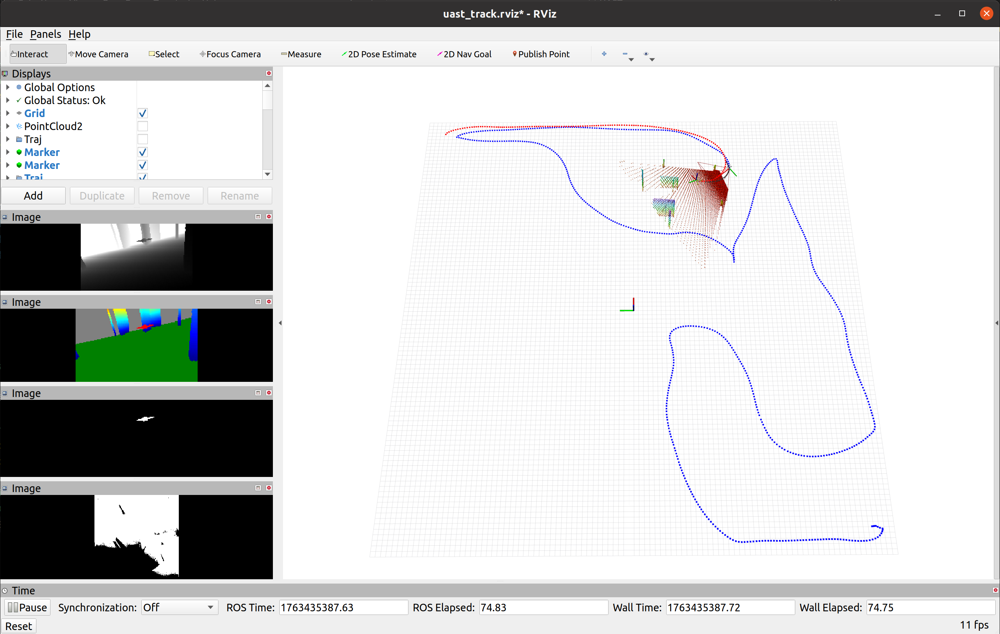

# UAST: Unified Active Search and Tracking for Arbitrary Targets with UAVs

## Introduction:

This repository presents a simplified implementation of the simulator version of the UAST method. UAST is a mapping-free solution that unifies active search and persistent tracking of arbitrary targets using only RGB-D observations, designed to operate efficiently in cluttered environments.


## Installation

The project was tested with Ubuntu 20.04 and Jetson Orin/Xavier NX. We assume that you have already installed the necessary dependencies such as CUDA, ROS, and Conda.

**1. Create Virtual Environment**

```
conda create --name uast python=3.8.20
conda activate uast
cd UAST
conda install pytorch==2.4.1 torchvision==0.19.1 torchaudio==2.4.1  pytorch-cuda=11.8 -c pytorch -c nvidia
pip install -r requirements.txt
```
**2. Build Simulator and Controller** 

Build the controller and dynamics simulator
```
conda deactivate
cd Controller
catkin_make
```
Build the environment and sensors simulator
```
conda deactivate
cd Simulator
catkin_make
```

## 3. Quick Demo

To run a demonstration of the UAST, follow these steps:


**1. Start the Controller and Dynamics Simulator** 

```
cd Controller
source devel/setup.bash
roslaunch so3_quadrotor_simulator simulator1.launch
```
**2. Start the Environment and Sensors Simulator**

```
cd Simulator
source devel/setup.bash
rosrun sensor_simulator sensor_simulator_cuda_multi
```

**3. Start the target and tracker UAV** 
```
cd UAST
export LD_PRELOAD=/usr/lib/x86_64-linux-gnu/libtiff.so.5
conda activate uast

# Launch target UAV
python test_uast_target.py

# Launch tracker UAV
python test_uast_track.py
```

**4. Visualization**

Start the RVIZ to visualize the images and trajectory. 
```
cd UAST

rviz -d uast_track.rviz
```

<p align="center">
    
</p>